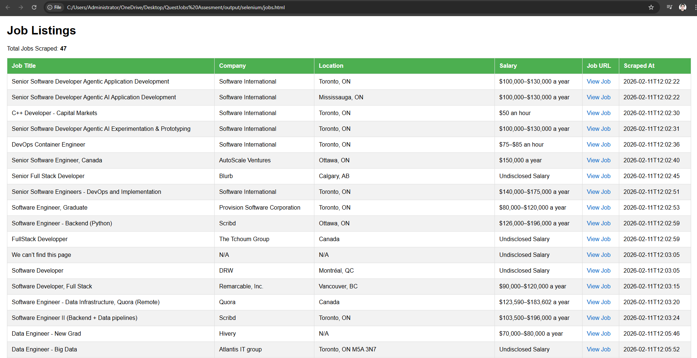
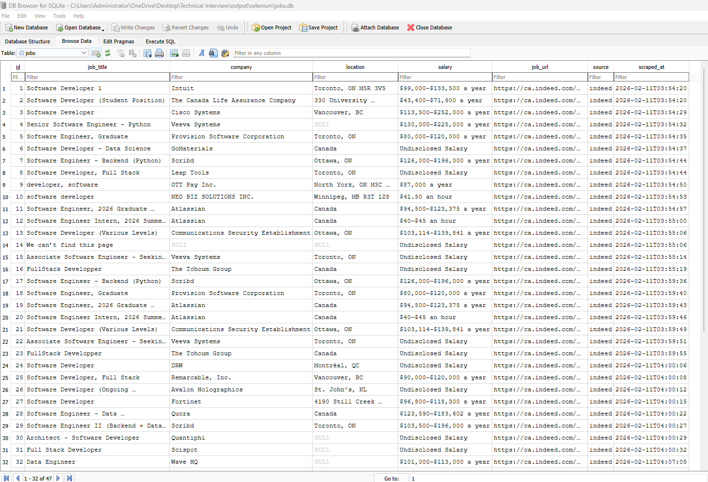
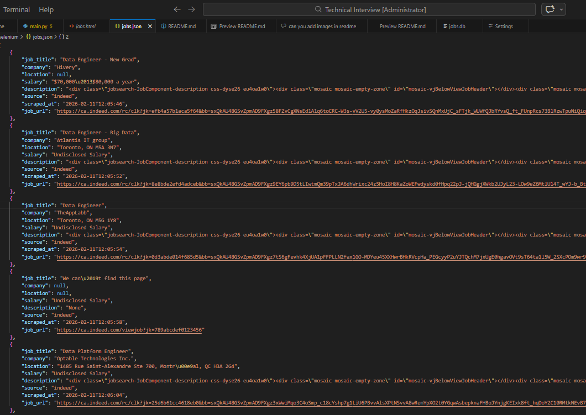

# Job Scraper

A web scraper that extracts job listings from Indeed Canada and generates HTML tables with clickable job links.

## Features

- Scrapes job listings from Indeed Canada
- Extracts job details (title, company, location, salary)
- Stores data in SQLite database
- Generates dynamic HTML table with clickable job URLs
- Concurrent job fetching for improved performance
- JSON export of scraped data

## Requirements

- Python 3.7+
- Chrome browser (for Selenium WebDriver)
- ChromeDriver (automatically managed by selenium)

## Installation

1. Clone or download this repository

2. Install dependencies:
```bash
pip install -r requirements.txt
```

## Usage

Run the scraper with a URL:

```bash
python selenium/main.py --url "https://ca.indeed.com/jobs?q=python+software+developer&l=&from=searchOnHP" --out output/selenium/ --db output/selenium/jobs.db
```

### Arguments

- `--url` (required): The Indeed Canada URL to scrape
- `--out` (optional): Output directory for JSON and HTML files (default: `output/selenium/`)
- `--db` (optional): SQLite database file path (default: `output/selenium/jobs.db`)

## Output

The script generates:

1. **jobs.json** - JSON file containing all scraped job data
2. **jobs.html** - Interactive HTML table with clickable job links
3. **jobs.db** - SQLite database containing job records

## Example

```bash
python selenium/main.py --url "https://ca.indeed.com/jobs?q=python+software+developer&l=&from=searchOnHPhttps://ca.indeed.com/jobs?q=python+software+developer&l=&from=searchOnHP" --out ./results/ --db ./results/jobs.db
```

This will:
- Scrape job listings from the provided URL
- Save data to `./results/jobs.json`
- Create/update `./results/jobs.db` with job records
- Generate `./results/jobs.html` with an interactive table

## Sample Outputs

### HTML Report



### Database


### Json



## Notes

- The scraper uses a 6-second delay when loading the initial page to ensure content loads
- Each job detail fetch has a 10-second timeout
- HTML table can be opened directly in any web browser

